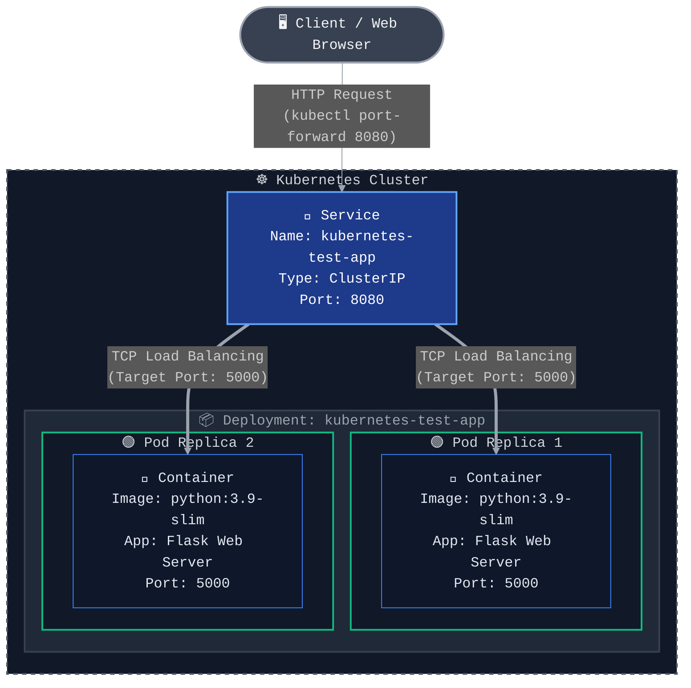

# ☸️ K8-prjct: Kubernetes Test Application

[](https://kubernetes.io/)
[](https://www.docker.com/)
[](https://flask.palletsprojects.com/)
[](https://www.python.org/)

A professional, containerized Python Flask web application designed to demonstrate the fundamentals of Kubernetes orchestration. This project provides a hands-on implementation of deploying a highly available web service using Docker and Kubernetes, complete with resource quotas, replica management, and internal load balancing.

---

## 🏗️ Architecture & Traffic Flow

The application follows a robust Kubernetes deployment architecture. External requests are routed through a Kubernetes Service which acts as an internal load balancer, distributing traffic across multiple identical Pod replicas to ensure high availability and fault tolerance.



### 🔄 Detailed Request Lifecycle:
1. **Ingress / Port-Forward:** The user accesses the application via a local port-forward mapped to the Kubernetes Service on port `8080`.
2. **Service Routing:** The `kubernetes-test-app` Service intercepts the traffic. Acting as a stable endpoint, it abstracts the underlying ephemeral Pods.
3. **Load Balancing:** The Service distributes the incoming HTTP request to one of the two active Pod replicas on target port `5000`.
4. **Application Processing:** The lightweight Flask container processes the request, renders the HTML template, and returns a personalized response.

---

## ✨ Core Features & Best Practices

- **High Availability:** Configured with `replicas: 2` to ensure the application remains accessible even if one pod fails.
- **Resource Optimization:** Explicit `requests` (32Mi RAM, 100m CPU) and `limits` (64Mi RAM, 200m CPU) prevent noisy-neighbor issues and ensure cluster stability.
- **Lightweight Containerization:** Utilizes `python:3.9-slim` to minimize the attack surface and reduce image pull times.
- **Stateless Architecture:** The Flask application is designed to be completely stateless, allowing seamless horizontal scaling.

---

## 📂 Project Structure

```text
K8-prjct/
├── app.py                # Main Flask application logic & routing
├── deployment.yaml       # K8s manifests (Deployment & Service definitions)
├── dockerfile            # Multi-layer Docker build instructions
├── requirements.txt      # Pinned Python dependencies (Flask==2.3.2)
├── static/
│   └── style.css         # UI styling assets
└── templates/
    └── index.html        # Jinja2 HTML template for the frontend
```

---

## 🚀 Deployment Guide

### Prerequisites
Ensure your local development environment is equipped with:
- [Docker Engine](https://docs.docker.com/get-docker/)
- A local Kubernetes cluster (e.g., [Minikube](https://minikube.sigs.k8s.io/docs/start/), [Docker Desktop](https://docs.docker.com/desktop/kubernetes/), or [kind](https://kind.sigs.k8s.io/))
- [kubectl](https://kubernetes.io/docs/tasks/tools/) CLI tool

### 1. Clone the Repository
```bash
git clone https://github.com/Rupeshbhardwaj002/K8-prjct.git
cd K8-prjct
```

### 2. Build the Docker Image
Build the container image directly into your local Docker registry.
```bash
docker build -t kubernetes-test-app:latest .
```
> **Note for Minikube Users:** You must point your terminal to Minikube's internal Docker daemon before building so Kubernetes can find the image:
> ```bash
> eval $(minikube docker-env)
> docker build -t kubernetes-test-app:latest .
> ```

### 3. Apply Kubernetes Manifests
Deploy the Application and Service to your cluster:
```bash
kubectl apply -f deployment.yaml
```

### 4. Verify Cluster State
Ensure all resources have been successfully provisioned:
```bash
# Check if both pod replicas are Running
kubectl get pods

# Verify the Service is exposing port 8080
kubectl get services
```

### 5. Access the Application
Establish a secure tunnel to the Kubernetes Service:
```bash
kubectl port-forward service/kubernetes-test-app 8080:8080
```
Navigate to [http://localhost:8080](http://localhost:8080) in your web browser to interact with the application.

---

## 🤝 Contributing
Contributions, issues, and feature requests are highly encouraged! Feel free to check the [issues page](https://github.com/Rupeshbhardwaj002/K8-prjct/issues) to get involved.

## 📝 License
This project is open-source and distributed under the [MIT License](LICENSE).
